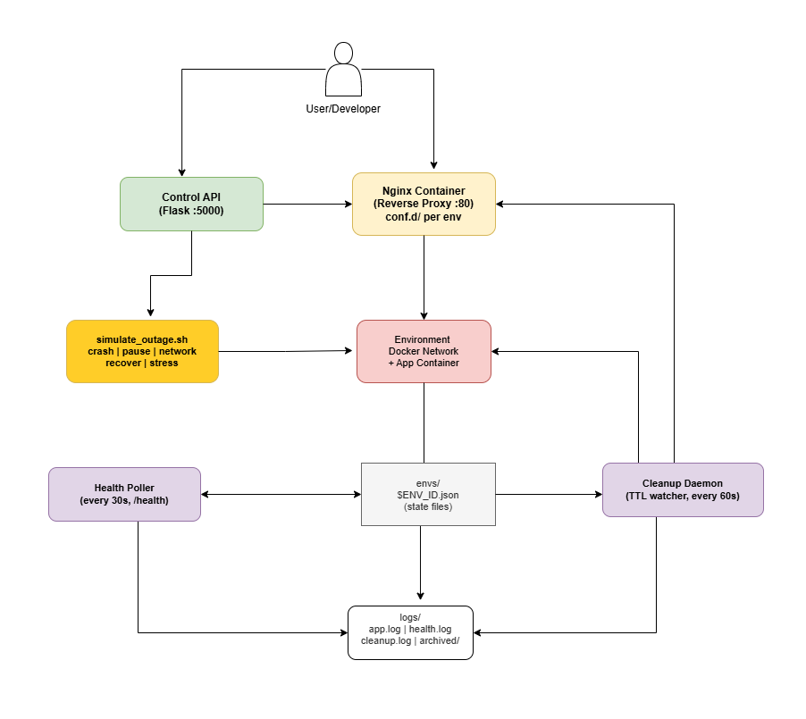

# DevOps Sandbox Platform

A self-service platform for spinning up isolated temporary environments, deploying apps, simulating outages, monitoring health, and auto-destroying environments on TTL expiry. Think miniature internal Heroku with a chaos engineering toggle.

---

## Architecture


---

## Prerequisites

- Docker
- Python 3 + pip
- `jq`
- `curl`
- `make`

Install dependencies:
```bash
sudo apt-get install -y docker.io jq curl make
pip3 install flask
```

---

## Quick Start (zero to first running env in 5 commands)

```bash
git clone https://github.com/Dorcas-BD/devops-sandbox.git
cd devops-sandbox
docker build -t sandbox-demo-app:latest ./demo-app
make up
make create
```

---

## Full Demo Walkthrough

### 1. Start the platform
```bash
make up
```
Starts Nginx container, cleanup daemon, health poller, and API server.

### 2. Create an environment
```bash
make create
# Enter name: myapp
# Enter TTL: 1800
```
Output gives you an ENV_ID and URL.

### 3. Check it's running
```bash
curl http://localhost:<PORT>/health
```

### 4. List active environments + TTL remaining
```bash
curl http://localhost:5000/envs
```

### 5. Check health status
```bash
make health
```

### 6. Simulate an outage
```bash
make simulate ENV=env-xxxxxxxx MODE=pause
```
Health monitor detects failure within 90 seconds and marks env as degraded.

### 7. Observe logs
```bash
make logs ENV=env-xxxxxxxx
```

### 8. Recover
```bash
make simulate ENV=env-xxxxxxxx MODE=recover
```

### 9. Manually destroy
```bash
make destroy ENV=env-xxxxxxxx
```

### 10. Auto-destroy
Environments are automatically destroyed when their TTL expires. The cleanup daemon checks every 60 seconds.

---

## API Endpoints

| Method | Endpoint | Description |
|--------|----------|-------------|
| POST | `/envs` | Create environment |
| GET | `/envs` | List active envs + TTL remaining |
| DELETE | `/envs/:id` | Destroy environment |
| GET | `/envs/:id/logs` | Last 100 lines of app.log |
| GET | `/envs/:id/health` | Last 10 health check results |
| POST | `/envs/:id/outage` | Trigger outage simulation |

---

## Makefile Targets

| Target | Description |
|--------|-------------|
| `make up` | Start Nginx, daemon, API, health poller |
| `make down` | Stop everything, destroy all envs |
| `make create` | Create new environment |
| `make destroy ENV=…` | Destroy specific environment |
| `make logs ENV=…` | Tail environment logs |
| `make health` | Show all env health statuses |
| `make simulate ENV=… MODE=…` | Run outage simulation |
| `make clean` | Wipe all state, logs, archives |

### Simulation modes
- `crash` — kills the container
- `pause` — pauses the container
- `network` — disconnects from Docker network
- `recover` — restores whatever was broken
- `stress` — CPU spike with stress-ng

---

## Known Limitations

- Nginx routing via subdomain (`env-id.localhost`) requires local DNS or `/etc/hosts` entry. Port-based access (`localhost:PORT`) works out of the box.
- Running on WSL2 may require Docker Desktop with WSL integration enabled.
- The health poller and cleanup daemon run as background processes — use `make down` to stop them cleanly.
- Log shipping uses Approach A (simple): `docker logs -f` piped to file. No log aggregator.
- API server uses Flask dev server — not production-grade.s


## Full Demo

### 1. Start the platform
```bash
make up
```
Starts Nginx container, cleanup daemon, health poller, and API server on port 5000.

---

### 2. Create an environment
```bash
make create
```
Enter a name and TTL when prompted. The script prints the ENV_ID and URL on completion.

---

### 3. Hit the app
```bash
curl http://localhost:<PORT>
curl http://localhost:<PORT>/health
```
Both return JSON responses from the demo app running inside the environment.

---

### 4. Check the API
```bash
curl http://localhost:5000/envs
```
Returns all active environments with TTL remaining.

---

### 5. Simulate an outage
```bash
make simulate ENV=env-xxx MODE=pause
curl http://localhost:<PORT>/health
```
Request hangs — container is frozen. Then recover:
```bash
make simulate ENV=env-xxx MODE=recover
curl http://localhost:<PORT>/health
```
App responds normally again.

---

### 6. Check logs
```bash
make logs ENV=env-xxx
```
Streams the last lines of the environment's app log.

---

### 7. Destroy the environment
```bash
make destroy ENV=env-xxx
curl http://localhost:<PORT>/health
```
Curl fails — container, network, and nginx config are all gone.

---

### 8. Auto-destroy
Environments are automatically destroyed when their TTL expires. The cleanup daemon checks every 60 seconds and calls `destroy_env.sh` on any expired environment.
